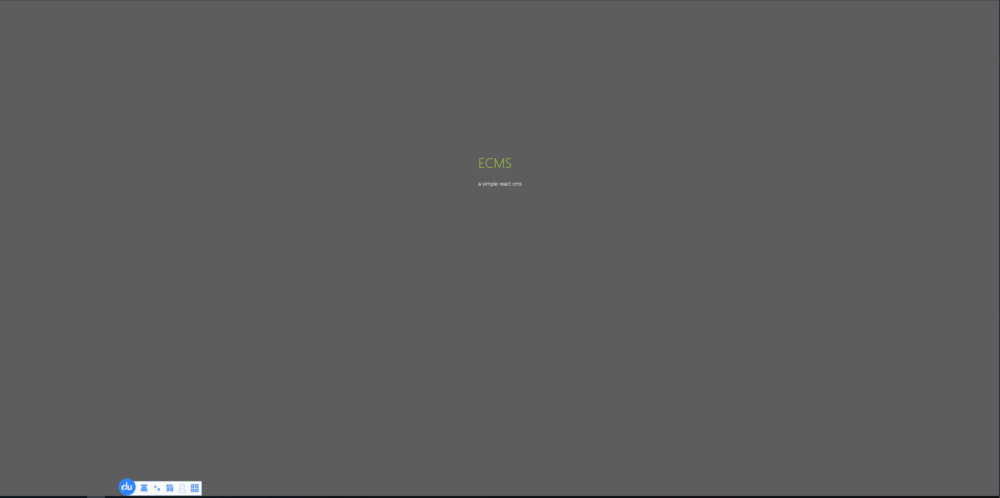
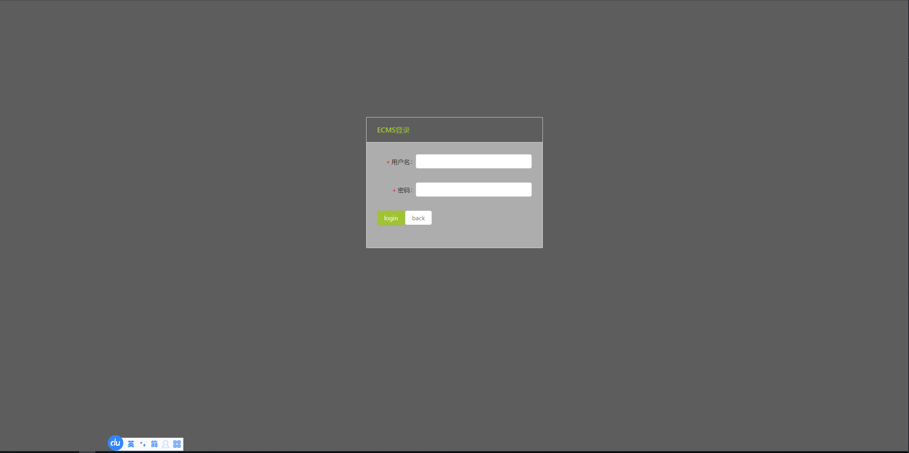
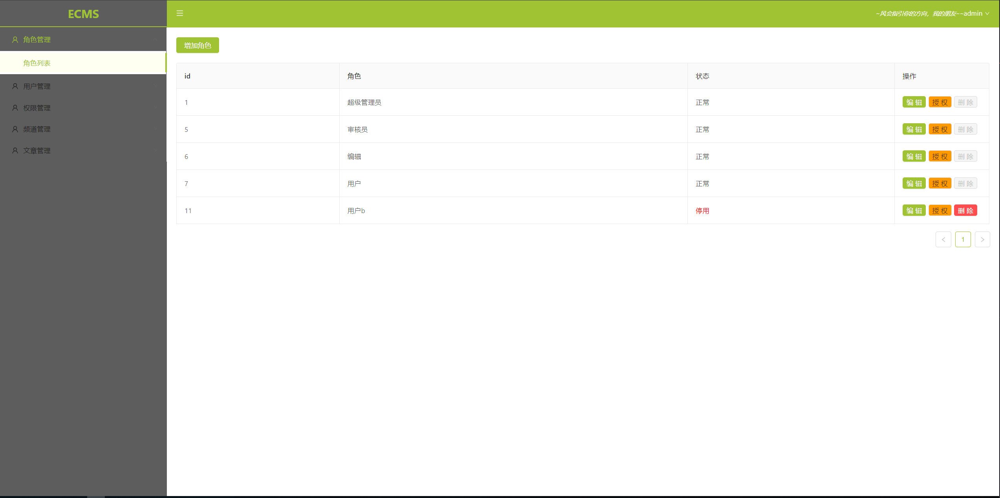
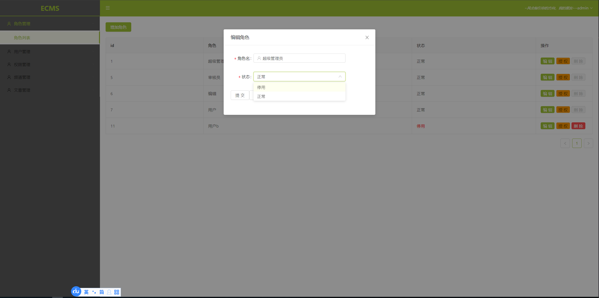
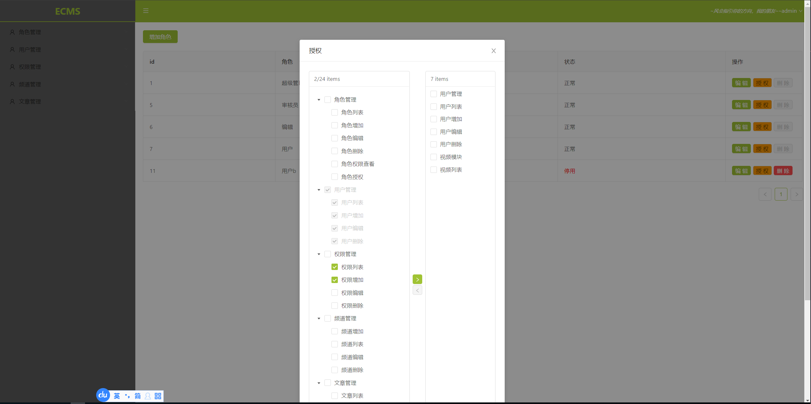
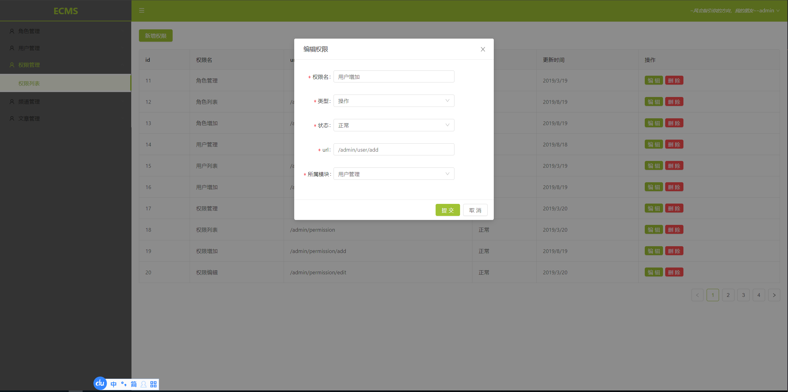

# ECMS

一个前端全栈cms项目，主要用于内容管理。
项目中包含了react、vue、koa、express技术栈，基本上涵盖了前端常用的主流技术。

后端使用eggjs，nestjs生成api，包括文章、人员、权限、内容审核流程等等。数据库使用MySQL，redis缓存。
使用jwt做身份校验，中间件拦截请求，判断权限。

前端分为admin和app两端，使用react做基本技术栈，包括redux, react-rdux, redux-thunk, styled-components等，admin端使用了antd做UI框架

还有一个服务端模板渲染，可以作为参考。

项目截图







项目目录
```js
| root
|-- ecms-admin // admin端
|-- ecms-app // app端
|-- egg-api // egg前后端分离 只提供api接口
|-- egg-ssr // egg服务端渲染
|-- nest-api // nest api 服务
```

项目将持续更新，改进。

目前进度

- [x] egg-api 异常捕获中间件 <br/>
- [x] egg-api jwt校验，权限中间件 <br/>
- [x] egg-api rbac <br/>
- [x] egg-api user role permission 接口 <br/>
- [x] egg-api egg-vaildate <br/>
- [] egg-api post resource等接口 <br/>
---

- [x] ecms-admin login <br/>
- [x] ecms-admin user <br/>
- [x] ecms-admin role <br/>
- [x] ecms-admin permission <br/>
- [] ecms-admin check post <br/>
- [] ecms-admin post <br/>
- [] ecms-admin resource <br/>
----
- [x] egg-ssr user role permission login module实现<br/>
----
- [] nest-api
